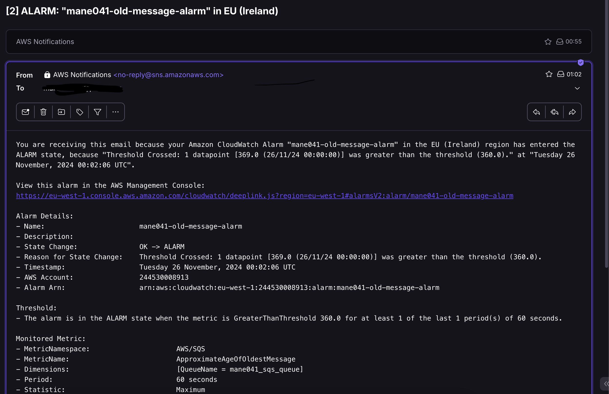

### Oppgave 1:

A: Endpoint til Lambda funksjon: https://0v2ids1yv8.execute-api.eu-west-1.amazonaws.com/Prod/generate-image
Har hatt en del problemer her og får stadig bad gateway ved post. Har testet mye forskjellig, sjekket at funksjonen ikke krever authorization og prøvd ulike policies

B: Kjørt pipeline:
https://github.com/martinnessa/PGR-301-DevOps-Exam/actions/runs/11824568856/job/32946357720

### Oppgave 2:  
Terraform apply pipeline:
https://github.com/martinnessa/PGR-301-DevOps-Exam/actions/runs/12017906332/job/33501263876

Terraform plan pipeline:  https://github.com/martinnessa/PGR-301-DevOps-Exam/actions/runs/12018072513/job/33501766247

SQS queue: https://sqs.eu-west-1.amazonaws.com/244530008913/mane041_sqs_queue

Example message:
```
aws sqs send-message --queue-url https://sqs.eu-west-1.amazonaws.com/244530008913/mane041_sqs_queue --message-body '{"prompt": "Could you generate an image of an ice bear doing a kickflip over a burning car"}'
```

 ### Oppgave 3:
```
docker pull martinnessa/devopsexam
```
Docker image: martinnessa/devopsexam  
SQS queue: https://sqs.eu-west-1.amazonaws.com/244530008913/mane041_sqs_queue  

#### Tagging strategi:
Min plan for tagging var at den nyeste releasen blir deployet ved push på main og tagges som latest-linux-corretto17 siden containeren kjøres i en linux container og bruker Corretto 17.

### Oppgave 4:  
Koden ligger i /oppgave2/infra/main.tf



### Oppgave 5:
1. Når det kommer til mikrotjenester så er veldig mange av dem bygget rundt docker containere nå. 
Med en slik arkitektur så deployer man som regel større servicer som ofte kan ha mange dependencies.
Man må da passe på at man tester skikkelig om man endrer kode i en av servicene ettersom at objektene og dataen som sendes frem og tilbake
må hentes og sendes på riktig måte. Når man skal deploye serverless funksjoner så vil man ofte
kunne deploye ny kode på en rask og effektiv måte. Dette kan man sette opp med f.eks. terraform.


2. En av de største forskjellene når det kommer til overvåkning er at man ved bruk av mikrotjenester
har bedre muligheter for å samle logger i en sentral logg eller gruppere dem etter
ulike typer tjenester. Når det gjelder logging i ett FaaS miljø så er man ofte bundet til
overåkningstjenestene til f.eks. AWS eller Azure og det kan føre til at man ikke har samme mulighet
til å konfigurere og samle logger og data på en enkel måte.


3. Jeg vil tro at serverless kan være en grei løsning økonomisk for funksjoner som ikke er i konstant bruk
og som det ikke er nødvendig å skalere opp veldig ofte. Serverless kan altså være en grei
løsning i en oppstartsfase for en startup, men etter hvert som man vokser og får mer trafikf
og større ressursbruk så kan det være lurt å ha en dedikert server for applikasjonen, og om man da kombinerer dette
med f.eks. å dockerize applikasjonen så kan det gjøre det lettere å skalere opp med flere containere.


4. En mikrotjeneste basert infrastruktur krever mer ansvar og ressurser fra DevOps teamene, men det gir også
muligheten til å skreddersy løsningene mye mer enn serverless og man er ikke like låst i hvilke verktøy og rammeverk
man kan ta i bruk. Serverless gjør mye av konfigurasjonen veldig enkelt for brukerene og det er som sagt billigere å kun betale for den compute tiden man faktisk bruker.


### Kilder:  
https://www.ibm.com/blog/serverless-vs-microservices/  
https://www.geeksforgeeks.org/microservices-vs-serverless/
